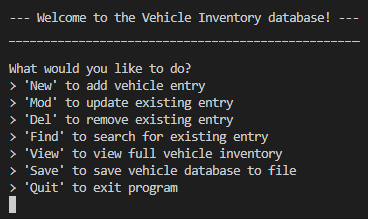
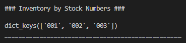
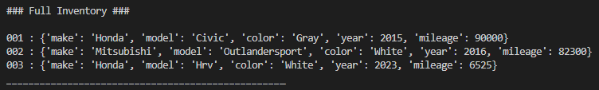

# Vehicle Inventory Database Manager 
Simple Python program for managing a car dealership inventory database.

## Table of Contents
* [General info](#general-info)
* [How to Run](#how-to-run)

## General Info
This program was built as my final portfolio project in my <strong>ITS320 - Basic Programming</strong> course at Colorado State University Global, and serves as the culmination of the knowledge I gained about coding in Python over the course of the term.

The UX centers around a main menu containing keywords that users can enter into the console to execute the various functions of the program.



The menu options perform the following functions:

```New```
> Prompts user to enter the stock number, make, model, color, year, and mileage of vehicle, to be added as a new entry to the database

```Mod```
> Enables the user to search for an existing database entry and modify it

```Del```
> Enables the user to delete an existing entry from the database

```Find```
> Enables the user to search for an existing entry via vehicle stock number

```View```
> Enables the user to view the current database

---

**NOTE**  
Via the 'View' sub-menu, two different view configurations are made available:

```ID```
> Prints out a list of dictionary keys corresponding to each of the vehicle stock numbers present in the database



```Full```
> Prints out each vehicle stock number in the database, along with details about the vehicle associated with it



---

```Save```
> Writes the current database dictionary to a new text file called ```inventory.txt```

```Quit```
> Exits the program


## How to Run
To run this program, simply download the ```vehicle-inventory-database-manager.exe``` file under "Releases" and double-click on the file once the download completes.
